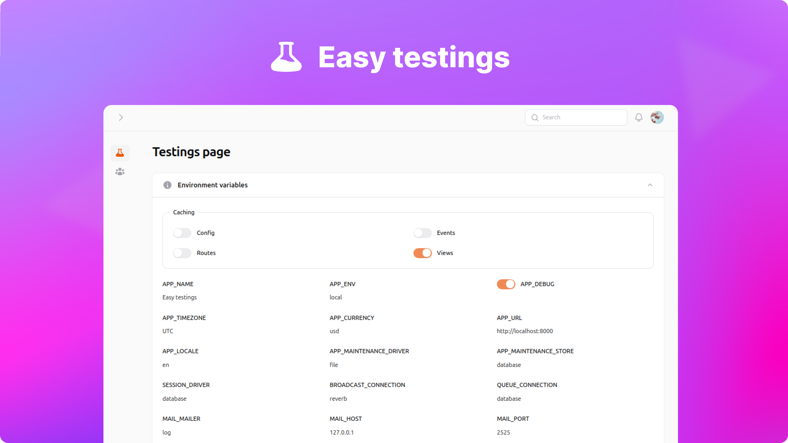

<p align="center">
    <a href="https://github.com/sakanjo/filament-easy-testings/actions"></a>
    <a href="https://laravel.com"></a>
    <a href="https://php.net"></a>
</p>

<p align="center">A Filament plugin to make testing easier.</p>

> ✨ Help support the maintenance of this package by [sponsoring me](https://github.com/sponsors/sakanjo).

Table of Contents
=================

- [Table of Contents](#table-of-contents)
  - [Install](#-install)
  - [Usage](#-usage)
  - [Presets](#presets)
    - [Default presets](#default-presets)
    - [Creating custom preset](#creating-custom-preset)
  - [Support the development](#-support-the-development)
  - [Credits](#%EF%B8%8F-credits)
  - [License](#-license)

## 📦 Install

Install the package via composer:

```
composer require sakanjo/filament-easy-testings
```

## 🦄 Usage

```php
<?php

// ...
use SaKanjo\FilamentEasyTestings\EasyTestingPlugin;
use App\Filament\EasyTestings\Presets\MyPreset;

public function panel(Panel $panel): Panel
{
    return $panel
        ->plugin(
            EasyTestingPlugin::make()
                ->preset(MyPreset::make())
        );
}
```

## Presets

Presets are the core of the plugin, allows you to create different tests with no limit.

### Default presets

The package comes with a default preset that you can use out of the box.

- `DefaultPreset`
- `EnvPreset`
- `WebsocketPreset`

### Creating custom preset

You can create your own custom preset by extending the `SaKanjo\FilamentEasyTestings\Presets\Preset` class.

```php
<?php

namespace App\Filament\EasyTestings;

use Filament\Forms;
use Filament\Notifications\Notification;
use SaKanjo\FilamentEasyTestings\Pages\TestingsPage;
use SaKanjo\FilamentEasyTestings\Presets\Preset;

class HelloPreset extends Preset
{
    public static function schema(): array
    {
        return [
            Forms\Components\Section::make('Say hi')
                ->persistCollapsed()
                ->icon('heroicon-m-bolt')
                ->schema([
                    Forms\Components\TextInput::make('name')
                        ->label('Name')
                        ->required(),

                    Forms\Components\Actions::make([
                        Forms\Components\Actions\Action::make('submit')
                            ->action(function (Forms\Get $get, TestingsPage $livewire): void {
                                $livewire->validateFields(['name']);
                                $name = $get('name');

                                Notification::make()
                                    ->title("Hello $name")
                                    ->send();
                            }),
                    ]),
                ]),
        ];
    }
}
```

## 💖 Support the development

**Do you like this project? Support it by donating**

Click the ["💖 Sponsor"](https://github.com/sponsors/sakanjo) at the top of this repo.

## ©️ Credits

- [Salah Kanjo](https://github.com/sakanjo)
- [All Contributors](../../contributors)

## 📄 License

[MIT License](https://github.com/sakanjo/filament-easy-testings/blob/master/LICENSE) © 2023-PRESENT [Salah Kanjo](https://github.com/sakanjo)
